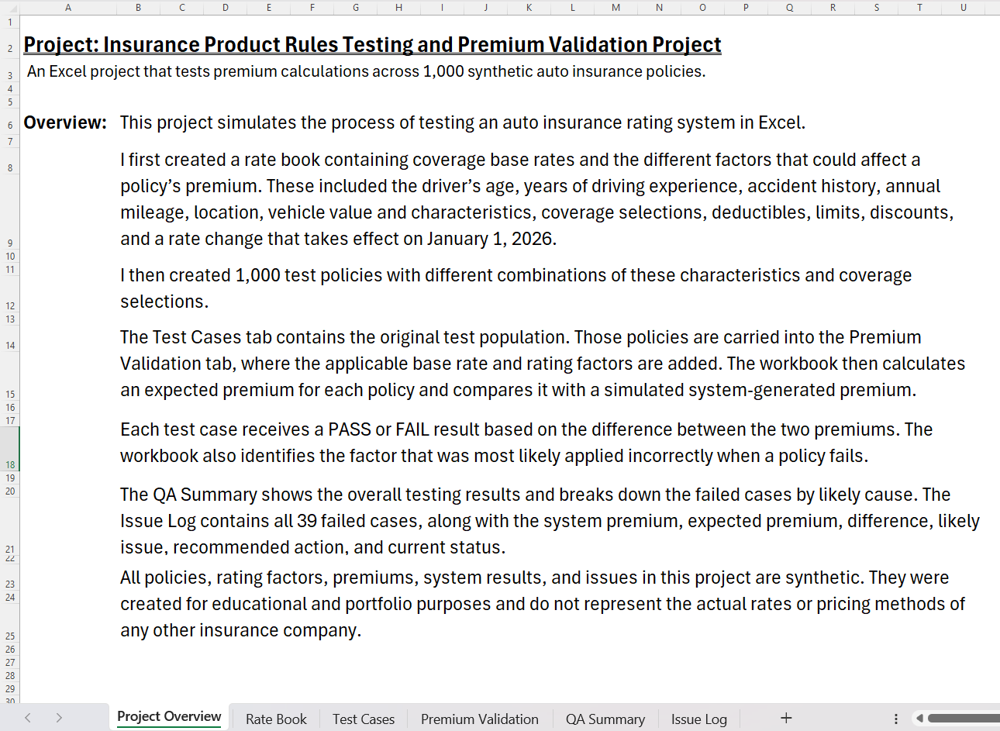
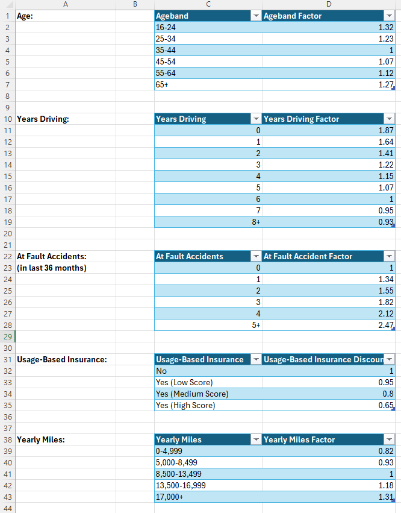
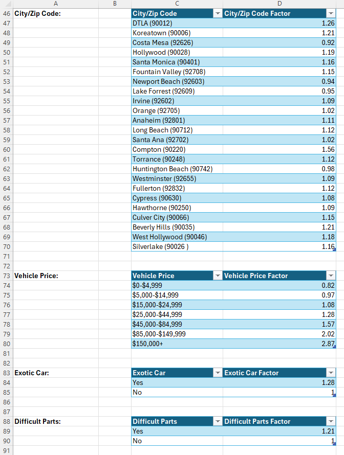
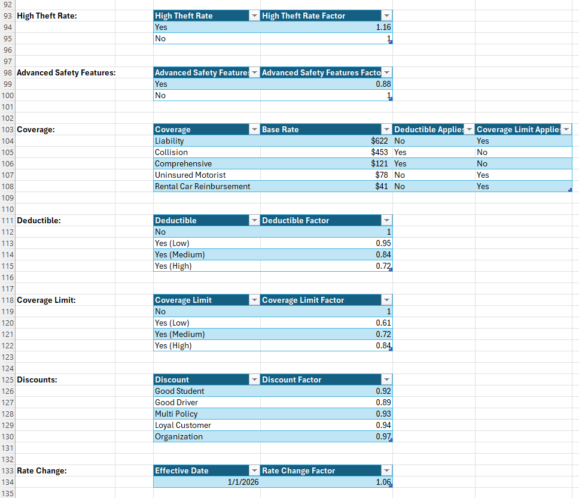
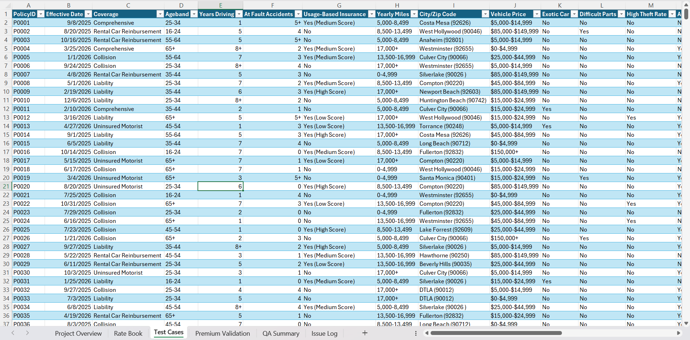
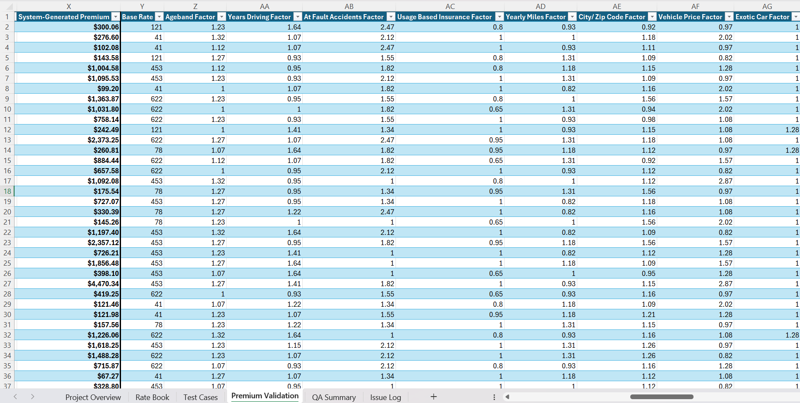
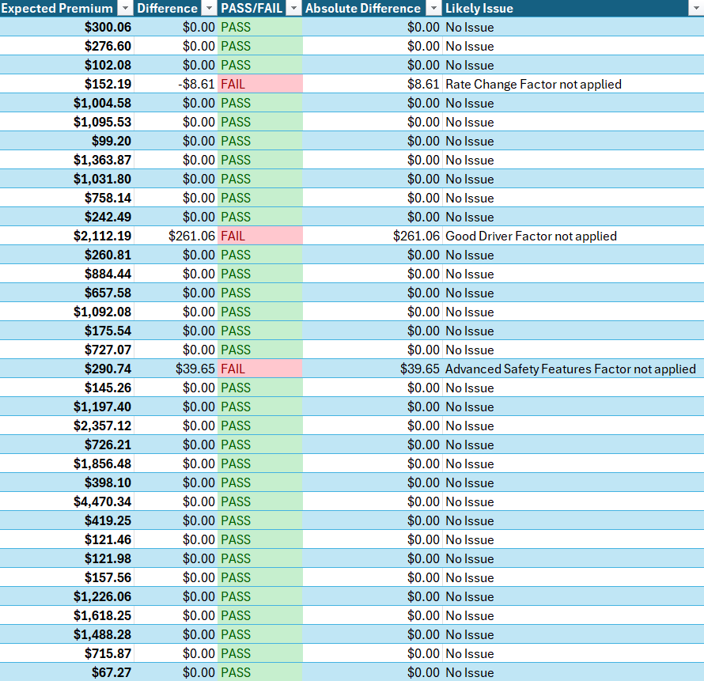
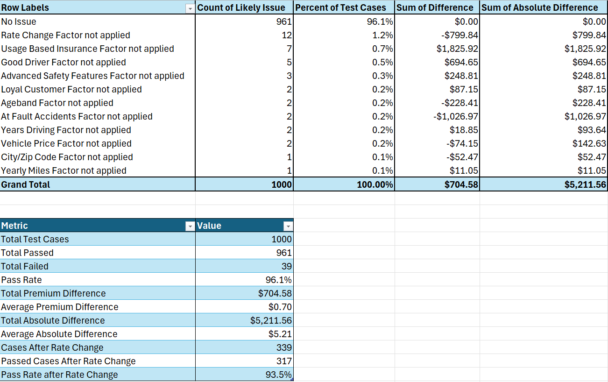
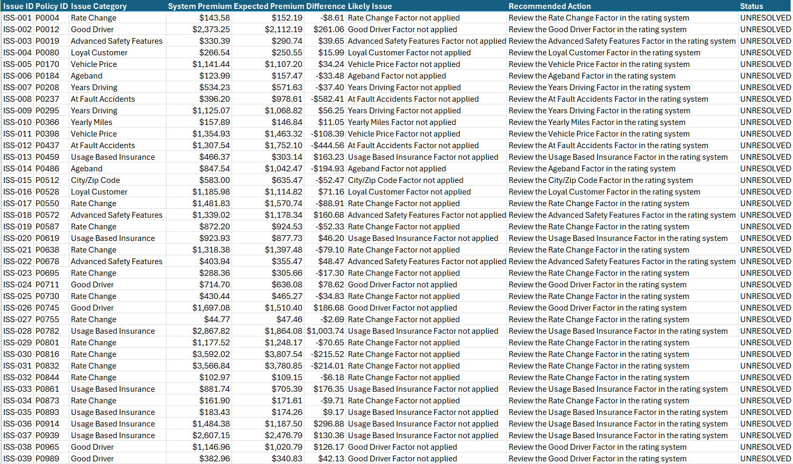

# Insurance Product Rules Testing and Premium Validation

## Project Overview

This Excel project simulates the process of testing an auto insurance rating system.

I created a synthetic rate book containing the rules and factors used to calculate premiums. The rate book includes:

- Coverage base rates
- Driver age
- Years of driving experience
- At-fault accidents
- Usage-based insurance results
- Annual mileage
- City and ZIP code
- Vehicle price
- Exotic vehicle status
- Difficult-to-replace parts
- Vehicle theft rates
- Advanced safety features
- Deductible selections
- Coverage limits
- Good Student discount
- Good Driver discount
- Multi-Policy discount
- Loyal Customer discount
- Organization discount
- An effective-date rate change

I then created 1,000 test cases with different combinations of these characteristics.

To build the test cases, I used Excel’s `CHOOSE` function together with random-number formulas to assign values to each policy. After generating the test cases, I copied and pasted the results as values so the test cases would remain fixed instead of changing whenever Excel recalculated.

For each test case, I calculated the expected premium using the rate book and compared it with the system-generated premium. Each test case is marked as PASS or FAIL based on whether there is a discrepancy between the two premiums.

Failed cases are grouped by their likely cause and added to an issue log with a recommended action.

[Download the Excel workbook](Insurance%20Product%20Rules%20Testing%20and%20Premium%20Validation%20Project.xlsx)



## Why I Built This Project

I originally created this project while preparing for an Actuarial Technician interview at AAA.

The position involved responsibilities such as reviewing rating rules, testing system calculations, validating premiums, and documenting issues. I wanted to better understand that type of work, so I created a project that allowed me to practice the process from beginning to end.

I later made the project more general so it could also show skills that apply to actuarial analyst, actuarial technician, insurance systems, quality assurance, and illustrations systems analyst positions.

## Main Question

Does the rating system apply the correct base rate, rating factor, discount, coverage rule, and effective-date change to each policy?

## How the Project Works

1. The **Rate Book** stores the base rates, rating factors, discounts, and coverage rules.
2. The **Test Cases** tab contains 1,000 synthetic policy scenarios.
3. The test cases are frozen as values so the policies remain unchanged during testing.
4. The policies are carried into the **Premium Validation** tab.
5. The applicable base rate and rating factors are retrieved for each policy.
6. An expected premium is calculated independently.
7. The expected premium is compared with the simulated system-generated premium.
8. Each policy is marked as PASS or FAIL.
9. Failed cases are assigned a likely cause.
10. The results are summarized in the **QA Summary**.
11. All failed cases are documented in the **Issue Log**.

## Rate Book

The rate book contains the base rates, factors, discounts, and coverage rules used in the expected-premium calculation.

The first section covers driver and usage-related factors such as age, driving experience, at-fault accidents, usage-based insurance results, and annual mileage.



The next section covers location and vehicle-related factors, including city and ZIP code, vehicle price, exotic vehicle status, and difficult-to-replace parts.



The final section includes additional vehicle factors, coverage base rates, deductible and limit rules, discounts, and the rate change effective January 1, 2026.



## Test Case Creation

The Test Cases tab contains the 1,000 test cases.

Each row represents a different test case with its own effective date, coverage, driver information, vehicle information, location, deductible, limit, and discount selections.

I used the `CHOOSE` function with random-number formulas to generate different combinations of policy characteristics. This made it possible to create a large and varied set of test cases without manually entering every field.

Once the test cases were generated, I copied the results and pasted them as values. This step was important because otherwise the test cases would change whenever Excel recalculated.



## Premium Calculation

The expected premium is calculated by starting with the coverage base rate and multiplying it by the factors that apply to the policy.

General formula:

```text
Expected Premium =
Base Rate
× Driver Factors
× Driving History Factors
× Usage-Based Insurance Factor
× Mileage Factor
× Location Factor
× Vehicle Factors
× Coverage Factors
× Discount Factors
× Rate Change Factor
```

The premium difference is calculated as:

```text
Difference =
System-Generated Premium - Expected Premium
```

The Premium Validation tab retrieves the base rate and rating factors that apply to each policy.



The workbook then compares the expected premium with the system-generated premium. Each policy receives a PASS or FAIL result, and failed cases are assigned a likely cause.



## Results

The final testing results were:

- **Total test cases:** 1,000
- **Passed:** 961
- **Failed:** 39
- **Overall pass rate:** 96.1%
- **Total premium difference:** $704.58
- **Total absolute premium difference:** $5,211.56
- **Average absolute premium difference:** $5.21
- **Policies effective after the rate change:** 339
- **Passed after the rate change:** 317
- **Pass rate after the rate change:** 93.5%

The most common issue was the **Rate Change Factor**, which accounted for 12 failed cases.

The **Usage-Based Insurance Factor** had the largest total absolute premium difference at $1,825.92.



*QA summary for all 1,000 test cases, including the overall pass rate, premium differences, post-rate-change results, and a breakdown of issues by likely cause.*

## Issue Log

All 39 failed cases were added to the Issue Log.

For each issue, the log includes:

- Issue ID
- Policy ID
- Issue category
- System-generated premium
- Expected premium
- Premium difference
- Likely cause
- Recommended action
- Current status



*Complete issue log containing all 39 failed test cases.*

## Workbook Tabs

| Tab | Purpose |
|---|---|
| Project Overview | Gives a short explanation of the project and workbook |
| Rate Book | Contains the base rates, rating factors, discounts, and product rules |
| Test Cases | Contains the original population of 1,000 fixed synthetic policies |
| Premium Validation | Calculates expected premiums and compares them with system results |
| QA Summary | Summarizes pass rates, failed cases, and premium differences |
| Issue Log | Documents all 39 failed cases and recommended actions |

## Skills Demonstrated

This project gave me hands-on practice with:

- Excel Tables and structured references
- `CHOOSE` and random-number formulas to create test cases
- `XLOOKUP`, `VLOOKUP`, and `INDEX/MATCH` to retrieve rates and rating factors
- `IF` formulas for factor applicability
- Conditional formatting to make passed and failed tests easy to identify
- Insurance premium calculations
- Expected-versus-system-generated premium comparisons
- Test case creation
- Effective-date rate testing
- PivotTables for summarizing results
- Root cause analysis
- Issue documentation
- Quality assurance and user acceptance testing concepts
- Communicating testing results
